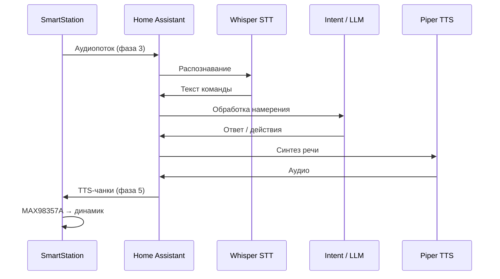

# 🏠 SmartStation — подробная настройка Home Assistant

Голосовой **сателлит** Assist: ESP32 **не выполняет** STT/Intent/TTS — только микрофон, динамик, wake-word (опционально) и кнопка. Всё «понимание» команд — на **Home Assistant**. Пайка и прошивка — в [`SETUP.md`](SETUP.md), обзор прошивки — [`README.md`](README.md).

| Плата | OTA manifest |
|-------|----------------|
| ESP32-C3 | `https://ota-s3.m3zold-lab.tech/firmware/mihazzzold.espHome-SmartStation.esp32c3/manifest.json` |
| ESP32-C6 | `https://ota-s3.m3zold-lab.tech/firmware/mihazzzold.espHome-SmartStation.esp32c6/manifest.json` |

---

## 📋 Оглавление

0. [Быстрый старт (чеклист)](#ha-quickstart)
1. [Что должно быть в HA](#ha-prereq)
1b. [Wyoming: Whisper, Piper, openWakeWord](#ha-wyoming)
2. [Добавление устройства ESPHome](#ha-esphome)
3. [Мастер SETUP на карточке устройства](#ha-setup)
4. [Все сущности в HA](#ha-entities)
5. [Пайплайн Assist (STT → Intent → TTS)](#ha-pipeline)
6. [Сателлит и комната](#ha-satellite)
7. [Wake-word: два режима](#ha-wake)
7b. [Карточка сателлита: «Фраза активации» unavailable](#ha-satellite-ui)
8. [Индикация LED (5 фаз)](#ha-led)
9. [Кнопка и тесты без умного дома](#ha-button-test)
10. [OTA из HA](#ha-ota)
11. [Экспозиция сущностей для голоса](#ha-expose)
12. [Примеры автоматизаций](#ha-automations)
13. [Частые проблемы](#ha-troubleshoot)

---

<a id="ha-quickstart"></a>
## 0. ⚡ Быстрый старт (чеклист)

| # | Шаг | Готово когда |
|---|-----|----------------|
| 1 | Дополнения **Whisper**, **Piper** (и **openWakeWord** при wake в HA) — **Запущены** | В интеграциях Wyoming три службы |
| 2 | **Настройки → Голосовые ассистенты** → `main`: Whisper + Piper + **Русский** | «Попробуйте голос» слышно |
| 3 | Assist в браузере отвечает (*«Который час?»*) | Текст/голос в UI Assist |
| 4 | **ESPHome** → станция **В сети**, `api_encryption_key` совпадает | Карточка SmartStation online |
| 5 | **SETUP:** язык → **Завершить настройку** | wizard status = завершена |
| 6 | Ассистент **main** → сателлит **SmartStation** | Assist satellite не offline |
| 7 | **Тест динамика** / **Тест микрофона** | Звук и запись OK |
| 8 | **Кнопка GPIO9** или **Okay Nabu** (wake в HA) | Команда → ответ в динамик |

Прямая ссылка на ассистентов: `/config/voice-assistants`.

---

<a id="ha-prereq"></a>
## 1. ⚙️ Что должно быть в HA

| Требование | Минимум | Рекомендация |
|------------|---------|--------------|
| Версия Home Assistant | **2023.5+** (Voice Assistant) | **2024.x / 2025.x** — полный Assist UI |
| ESPHome (интеграция) | Встроена в HA OS / Container | Актуальная версия |
| Сеть | Станция и HA в одной LAN | Статический DHCP для HA по желанию |
| `api_encryption_key` | Один ключ в `firmwares/secrets.yaml` и при добавлении узла | Сгенерировать один раз и не менять |

### Дополнения (add-ons) для локального голоса

Установите через **Настройки → Дополнения → Магазин дополнений** (или Supervisor):

| Дополнение | Роль в пайплайне | Заметка |
|------------|------------------|---------|
| **Whisper** (Wyoming) | STT — речь → текст | Модель `small` / `base` для русского; на слабом железе — `tiny` |
| **Piper** (Wyoming) | TTS — текст → звук | Голос с поддержкой **ru** (например `ru_RU-dmitri-medium`) |
| **openWakeWord** (Wyoming) | Wake-word **в HA** | Нужен, если **«Движок wake-word»** = *В Home Assistant* |

Альтернатива: **Home Assistant Cloud**, Google, OpenAI и др. — если уже используете их в других ассистентах.

> 💡 **Совет:** Сначала поднимите Whisper + Piper, проверьте Assist **без** станции (микрофон браузера или телефон), затем подключайте SmartStation.

---

<a id="ha-wyoming"></a>
## 1b. 🔗 Wyoming: Whisper, Piper, openWakeWord

### Установка

1. **Настройки → Дополнения → Магазин** → установить **Whisper**, **Piper**, при wake в HA — **openWakeWord**.
2. У каждого дополнения: **Запустить** + **Запускать при загрузке**.
3. Подождать 1–2 минуты.

### Интеграция (предпочтительно автоматически)

1. **Настройки → Устройства и службы** → внизу **Обнаружено**.
2. Для **Whisper** и **Piper** → **Настроить** (хост/порт не вводить).
3. Если пусто — **перезагрузить Home Assistant**, снова проверить **Обнаружено**.

### Вручную (Wyoming Protocol)

Только если обнаружение не сработало:

| Сервис | Порт (типично) | Хост (попробовать по порядку) |
|--------|----------------|-------------------------------|
| Whisper | **10300** | `core-whisper`, затем IP HA |
| Piper | **10200** | `core-piper`, затем IP HA |
| openWakeWord | **10400** | `core-openwakeword`, затем IP HA |

Порт **0** не оставлять. Хост/порт — со вкладки **Информация** / **Сеть** у **запущенного** дополнения.

В интеграциях должна быть одна карточка **Wyoming Protocol** с тремя **службами** (как на вашем скрине).

---

<a id="ha-esphome"></a>
## 2. 🔌 Добавление устройства ESPHome

### После USB-прошивки

1. Убедитесь, что в `firmwares/secrets.yaml` заданы `wifi_ssid`, `wifi_password`, **`api_encryption_key`**, `ota_password`.
2. Станция подключается к Wi‑Fi; в логах прошивки (ESPHome / UART): `Connected to WiFi`, затем при успехе API — `Voice Assistant client connected to Home Assistant`.

### Если устройство ещё не в HA

1. **Настройки → Устройства и службы → Добавить интеграцию → ESPHome**
2. Хост: `esp-XXXXXXXX-XXX.local` (имя из `esphome.name`) или IP из роутера
3. Порт: **6053**
4. **Пароль шифрования** — значение `api_encryption_key` из secrets (Base64, 32 байта)

Сгенерировать новый ключ (если прошивали без ключа):

```powershell
python -c "import secrets, base64; print(base64.b64encode(secrets.token_bytes(32)).decode())"
```

### Если Wi‑Fi не настроен

- Точка доступа: `station-XXX-setup` (суффикс из serial)
- **Captive portal** — задать SSID/пароль с телефона
- Или перепрошить с теми же `wifi_*`, что в secrets

### Проверка связи

**Настройки → Устройства** → карточка **SmartStation · …** → статус **В сети**.

Логи в HA: **Настройки → Система → Логи** (фильтр `esphome`) или устройство ESPHome → **Просмотр логов**.

Ожидаемая строка на устройстве:

```text
Фаза 1: подключён к Home Assistant, ожидание wake-word
```

Если видите `отключён от Home Assistant` — ключ API, Wi‑Fi или версия HA.

---

<a id="ha-setup"></a>
## 3. ✅ Мастер SETUP (первый запуск)

После первого подключения к HA на карточке устройства появятся сущности **SETUP:**. Пока мастер не завершён, **SETUP: wizard status** показывает *«Нужна первичная настройка…»*.

| Шаг | Сущность | Действие |
|-----|----------|----------|
| 1 | **SETUP: language · язык** | **Русский** или **English** (влияет на тексты OTA на устройстве, не на язык Assist) |
| 2 | **Движок wake-word** | Выберите режим (см. [раздел 7](#ha-wake)) — можно позже |
| 3 | **SETUP: finish wizard · завершить настройку** | Нажать **один раз** |

После шага 3: **SETUP: wizard status** → *«Настройка завершена»*. Флаг хранится во flash.

> ⚠️ **Внимание:** **SYS: сброс к заводу** сбрасывает Wi‑Fi и настройки — мастер SETUP нужно пройти снова.

Опционально в монорепозитории: blueprint  
`homeassistant/blueprints/automation/mihazzzold_esphome_device_onboarding.yaml` — напоминание в HA, если мастер не завершён.

---

<a id="ha-entities"></a>
## 4. 📟 Все сущности в HA

Имена совпадают с подписями в прошивке. **Entity ID** в HA строится автоматически (slug от `esphome.name`, например `esp-1779448484-109` → `esp_1779448484_109_…`). Точный ID: карточка устройства → сущность → **(i)**.

### Голос и управление

| Подпись в HA | Тип | Назначение |
|--------------|-----|------------|
| *(внутренняя)* **Voice Assistant** | — | Связь Assist; не отдельная кнопка в UI |
| **Движок wake-word** | `select` | *На устройстве* / *В Home Assistant* |
| **Кнопка активации** | `binary_sensor` | GPIO9 — push-to-talk / прервать сессию |
| **Статус станции** | `light` (diagnostic, по умолчанию скрыт) | LED GPIO8, эффекты «Слушаю» / «Запись» |

### Тесты (диагностика)

| Подпись | Тип | Поведение |
|---------|-----|-----------|
| **Тест динамика (4 с) 🔊** | `button` | 4 с сессия Assist → звук в динамик (MAX98357A) |
| **Тест микрофона (10 с) 🎤** | `button` | 10 с запись INMP441 → поток в HA |

### SETUP и OTA

| Подпись | Тип |
|---------|-----|
| **SETUP: language · язык** | `select` |
| **SETUP: wizard status** | `text_sensor` |
| **SETUP: finish wizard · завершить настройку** | `button` |
| **OTA: обновление прошивки** | `update` |
| **OTA: проверить обновления** | `button` |
| **OTA: установить прошивку** | `button` |
| **FW: прошивка сейчас** | `text_sensor` |
| **FW: прошивка в каталоге** | `text_sensor` |
| **OTA: статус проверки** | `text_sensor` |
| **OTA: ошибка обновления** | `text_sensor` |

### Служебные (можно скрыть)

| Подпись | Тип |
|---------|-----|
| **SYS: сброс к заводу** | `button` |
| **DIAG: версия ESPHome**, **DIAG: температура чипа**, **DIAG: время работы**, heap | `sensor` / `text_sensor` |
| **NET: уровень Wi-Fi**, **NET: DNS (по DHCP)** | `sensor` / `text_sensor` |

При **«Движок wake-word» = На устройстве** в HA могут появиться сущности **microWakeWord** (модели `okay_nabu`, `hey_jarvis`) — их можно включать/отключать по желанию.

---

<a id="ha-pipeline"></a>
## 5. 🤖 Пайплайн Assist (STT → Intent → TTS)

Схема потока:



### Шаг 1 — Установить Wyoming-сервисы

1. Установите дополнения **Whisper**, **Piper**, при режиме wake в HA — **openWakeWord**
2. Запустите их; в **Настройки → Устройства** появятся службы Wyoming

### Шаг 2 — Создать голосового ассистента

1. **Настройки → Голосовые ассистенты** (Voice assistants)
2. **Создать ассистента** (или изменить существующего)

| Блок | Что выбрать |
|------|-------------|
| **Speech-to-text** | Wyoming Whisper (или другой STT с русским) |
| **Обработка** | **Home Assistant** — локальные команды; опционально OpenAI / Conversation API |
| **Text-to-speech** | Wyoming Piper с русским голосом |
| **Язык** | **Русский** (если команды по-русски) |
| **Wake word** (если wake в HA) | Модель из openWakeWord в настройках ассистента |

3. Сохраните ассистента

### Шаг 3 — Проверка без станции

**Настройки → Голосовые ассистенты** → ваш ассистент → **Проверить голосовые команды** (или Assist в браузере / приложении HA).

Команда вроде *«Какая погода?»* должна дать ответ. Если здесь тишина — сначала чините Whisper/Piper, не станцию.

### Шаг 4 — Привязать SmartStation как сателлит

Формулировки UI меняются между версиями HA:

**Вариант A (новые версии):**

1. **Настройки → Голосовые ассистенты** → ваш ассистент
2. Раздел **Устройства**, **Satellites** или **Preferred satellite**
3. Добавьте устройство **SmartStation · …** (ESPHome)

**Вариант B (через устройство):**

1. **Настройки → Устройства** → **SmartStation · …**
2. Найдите настройку **Assist**, **Use as voice satellite** / **Использовать как голосовой сателлит**
3. Выберите **того же** ассистента, что в шаге 2

### Шаг 5 — Перезагрузка и лог

1. Перезагрузите ESP (питание или **перезагрузка** из ESPHome, если есть)
2. В логах устройства: `Voice Assistant client connected to Home Assistant`
3. Скажите wake-word или нажмите **Кнопка активации** → LED «слушает» → произнесите команду → ответ из динамика

> 💡 **Совет:** `conversation_timeout` в прошивке — **300 с** (5 мин). Длинный диалог без повторного wake возможен в рамках одной сессии.

---

<a id="ha-satellite"></a>
## 6. 🏡 Сателлит и комната

1. **Настройки → Области и этажи** — создайте комнату (например «Гостиная»)
2. Перетащите **SmartStation · …** в эту комнату
3. Команды с привязкой к комнате работают точнее: *«Включи свет **в гостиной**»*

Убедитесь, что целевые `light.*`, `switch.*`, `cover.*` **не disabled** и видны ассистенту (не скрыты категорией «config» без нужды).

---

<a id="ha-wake"></a>
## 7. 🗣️ Wake-word: два режима

Сущность **«Движок wake-word»** (`select`, сохраняется на устройстве):

| Значение | Где ловится фраза | Модели / настройка |
|----------|-------------------|---------------------|
| **На устройстве** | ESP: `micro_wake_word` | **okay nabu**, **hey jarvis** (в прошивке). В HA — сущности microWakeWord при необходимости |
| **В Home Assistant** | Поток на сервер | **openWakeWord** в пайплайне ассистента + wake в настройках ассистента |

**Кнопка GPIO9** (сущность **Кнопка активации**):

- Короткое нажатие, сессия **не** идёт → **начать слушать** (как wake)
- Нажатие во время сессии → **остановить** и вернуться к ожиданию wake

> ⚠️ Фразы вроде «Окей, Google» или «Привет, Home» **не вшиты**. Нужна своя модель [microWakeWord](https://esphome.io/components/micro_wake_word) или wake-word в HA. Для русского часто проще: **кнопка** или wake **в HA** с openWakeWord.

Переключение режима: устройство на ~0,5 с останавливает старый движок и запускает новый (`stop_wake_word` → `start_wake_word`).

---

<a id="ha-satellite-ui"></a>
## 7b. 📟 Карточка сателлита: «Фраза активации» = unavailable

Это **нормально**, если **«Движок wake-word»** = **В Home Assistant**.

| Поле на устройстве | Почему `unavailable` | Где задаётся реально |
|--------------------|----------------------|----------------------|
| **Фраза активации** | HA не показывает wake-фразу на карточке ESP-сателлита | **Голосовые ассистенты → main → Okay Nabu** (openWakeWord) |
| **Wake word 2** | Дубль поля «Ассистент» / Assistant 2 | Игнорировать |
| **Время активации** | Только во время активной сессии Assist | В покое — `unavailable` |

**Кнопка GPIO9** работает без этого поля. Если кнопка OK, а **Okay Nabu** не ловит — проверьте дополнение **openWakeWord** (запущено) и произносите фразу **по-английски** (*Okay Nabu*).

---

<a id="ha-led"></a>
## 8. 💡 Индикация LED (5 фаз)

| Фаза | Состояние | LED (GPIO8) |
|------|-----------|-------------|
| 1 | Ожидание, API OK | Тускло (~15%) при wake **на устройстве**; выкл при wake **в HA** |
| 2 | Wake / кнопка | Переход к записи |
| 3 | Слушает команду | Пульс **«Слушаю (медленно)»** |
| 3 | VAD — речь | Пульс **«Запись (быстро)»** |
| 5 | TTS | Ярко, без эффекта |
| Ошибка VA | `on_error` | Ярко 2 с, затем сброс |

Сущность **Статус станции** (`light`) по умолчанию **disabled** — для отладки можно включить в HA.

---

<a id="ha-button-test"></a>
## 9. 🔘 Кнопка и тесты без умного дома

Порядок диагностики **до** сложных команд:

1. **Тест динамика (4 с)** — должен быть слышен звук из HA (тишина/шум от TTS). Нет звука → Piper, питание **5 V** на MAX98357A, пайка **GPIO1 → DIN**
2. **Тест микрофона (10 с)** — говорите в INMP441; в логах HA/ESPHome — активность Voice Assistant. Нет реакции → **GPIO6 ← SD** мика, **3.3 V** на INMP441
3. **Кнопка активации** — без wake, должна запускать ту же сессию
4. Команда умному дому: *«Включи …»* / *«Выключи свет в …»*

---

<a id="ha-ota"></a>
## 10. 🚀 OTA из HA

| Сущность | Действие |
|----------|----------|
| **OTA: обновление прошивки** | Сущность `update` — как «Обновление прошивки» в карточке |
| **OTA: проверить обновления** | Ручная проверка manifest |
| **OTA: установить прошивку** | Установка после успешной проверки |

- **C3** читает только каталог `…SmartStation.esp32c3/`
- **C6** — только `…SmartStation.esp32c6/`
- Старый путь `mihazzzold.espHome-SmartStation` **без суффикса** в новых шаблонах не используется

При **HTTP 403** на manifest — проблема **сервера MinIO** (файлы / anonymous download), не настроек HA.

Проверка с ПК:

```powershell
curl -I "https://ota-s3.m3zold-lab.tech/firmware/mihazzzold.espHome-SmartStation.esp32c6/manifest.json"
```

Ожидается **HTTP 200**.

---

<a id="ha-expose"></a>
## 11. 📢 Экспозиция сущностей для голоса

Assist выполняет только те действия, которые **разрешены** для ассистента:

1. **Настройки → Голосовые ассистенты** → ассистент → **Сущности** / **Expose**
2. Включите нужные комнаты, устройства, сущности
3. Или на карточке лампы/реле: **Настройки сущности** → **Голосовой ассистент** / **Assist** — разрешить

Без экспозиции станция «слышит», но ответит, что не может выполнить команду.

---

<a id="ha-automations"></a>
## 12. ⚡ Примеры автоматизаций

Подставьте **entity_id** с карточки устройства (Настройки → Устройства → SmartStation → сущность → информация).

### LED при нажатии кнопки (уведомление в HA)

```yaml
alias: "SmartStation — кнопка нажата"
trigger:
  - platform: state
    entity_id: binary_sensor.ВАШ_esp_Кнопка_активации
    to: "on"
action:
  - service: notify.persistent_notification
    data:
      title: "SmartStation"
      message: "Нажата кнопка активации"
```

### Напоминание завершить SETUP

Используйте blueprint `mihazzzold_esphome_device_onboarding.yaml` или условие по **SETUP: wizard status** содержит *«Нужна первичная»*.

### Переключить wake на HA ночью (опционально)

```yaml
alias: "SmartStation — wake в HA ночью"
trigger:
  - platform: time
    at: "23:00:00"
action:
  - service: select.select_option
    target:
      entity_id: select.ВАШ_Движок_wake_word
    data:
      option: "В Home Assistant"
```

---

<a id="ha-troubleshoot"></a>
## 13. 🐛 Частые проблемы

| Симптом | Что проверить |
|---------|----------------|
| Устройство **Offline** | Wi‑Fi, `api_encryption_key`, ping IP станции |
| **Offline после OTA** с сервера | См. [восстановление ниже](#ha-offline-after-ota) — часто сменился `esphome.name` или Wi‑Fi/API из CI |
| Нет строки `Voice Assistant client connected` | Версия HA, интеграция ESPHome, перезагрузка HA |
| Молчит после команды | Piper/TTS в ассистенте; **5 V** на MAX98357A; сателлит привязан к ассистенту |
| Не слышит / пустой STT | INMP441 **GPIO6**, 3.3 V; Whisper; тест микрофона 10 с |
| Wake не срабатывает | Режим **Движок wake-word**; громкость; попробуйте **кнопку** |
| «Okay Nabu» не реагирует | Режим должен быть **На устройстве**; английская фраза |
| Wake в HA не работает | **openWakeWord** + wake в ассистенте; режим **В Home Assistant** |
| Треск / эхо | Общая GND, короткие I2S, питание усилителя |
| OTA 403 / AccessDenied | MinIO, заливка `manifest.json` + `latest.bin` в правильный каталог C3/C6 |
| После OTA «не та» плата | Прошили C6 manifest на C3 — пересобрать с `--board-profile` |
| GPIO8/9 warnings (C6) | Strapping — норма; не вешать сильные подтяжки |
| Два LED конфликтуют | В runtime есть `status_led` на GPIO8 и PWM «Статус станции» — для отладки смотрите PWM-индикацию фаз |

---

<a id="ha-offline-after-ota"></a>
## 🔴 Offline после OTA (ESPHome Dashboard / HA)

### Почему так бывает

1. **Другое имя узла (`esphome.name`)** — при USB вы прошили с уникальным serial (`esp-1779448484-109`), а OTA-бинарник с CI был собран **до** заводского режима (случайный `esp-…`) или вы смешали dev и factory. После OTA станция в сети под **другим** hostname, а Dashboard и HA ждут старый → **OFFLINE**.
2. **Другой `api_encryption_key` или Wi‑Fi** — если в GitHub Secret `ESPHOME_CI_SECRETS_YAML` не совпадает с вашим локальным `firmwares/secrets.yaml`, после OTA станция не подключится к вашей сети/API.

### Быстрая диагностика

```powershell
ping esp-1779448484-109.local
# Ищите в роутере esphome-smartstation-….local (завод) или esp-….local (dev serial)
```

Если старый хост не пингуется, а в роутере появился **другой** ESP — это пункт 1.

### Восстановление (рекомендуется): USB с тем же serial

```powershell
cd d:\MyProjects\esphomeFlasher
$env:FLASHER_SERIAL_NUMBER = "esp-1779448484-109"
py -3.13 scripts/flasher.py --local `
  -f firmwares-external/mihazzzold.espHome-SmartStation/espHome_SmartStation.yaml.j2 `
  --board-profile esp32c6-supermini `
  -a run --port COM19 -y
```

Используется **ваш** `firmwares/secrets.yaml` (Wi‑Fi + тот же `api_encryption_key`, что в HA).

После загрузки:

1. ESPHome Dashboard — устройство снова **Online** (тот же `smartstation.yaml` / тот же host).
2. Home Assistant — перезагрузите интеграцию ESPHome при необходимости; ключ API не меняйте, если не меняли secrets.

### Если USB недоступен

- Точка доступа **`station-109-setup`** (или суффикс из вашего serial) + captive portal — только если в CI-прошивке совпали `ap_password` и вы ещё в зоне AP.
- Иначе только USB или esptool с локально собранным `.bin`.

### Как избежать повторения (вариант A — рекомендуется)

| Сценарий | Действие |
|----------|----------|
| **Продажа / серверный OTA** | Заводская USB-прошивка: `--factory-build` → `esphome-smartstation` + `name_add_mac_suffix`, **без** STA Wi‑Fi из secrets; покупатель настраивает Wi‑Fi через AP **station-setup** / Improv |
| OTA с **ota-s3** (CI) | SmartStation в CI: `FLASHER_FACTORY_BUILD=1` + `FLASHER_OTA_GENERIC_BUILD=1` — тот же заводской образ, что и на линии |
| **Своя dev-станция** | Не обновляйте её серверным OTA, пока в HA завязан уникальный `esp-…`; либо OTA только бинарником с тем же `FLASHER_SERIAL_NUMBER` |
| Секреты CI | Для **заводского** OTA STA Wi‑Fi в bin не нужен; `api_encryption_key` в CI всё равно должен совпадать с HA **после** первичной привязки, если вы вшиваете ключ в CI secrets |

> Уже прошитые уникальные serial **один раз** восстановите по USB (`FLASHER_SERIAL_NUMBER`), затем либо оставайтесь на dev, либо осознанно перейдите на `--factory-build` + заново добавьте устройство в HA по новому hostname.

---

## ✅ Чеклист «станция готова»

- [ ] ESPHome: устройство **В сети**
- [ ] SETUP: язык + **Завершить**
- [ ] Whisper + Piper (и при необходимости openWakeWord) **запущены**
- [ ] Голосовой ассистент создан, язык **Русский**
- [ ] SmartStation добавлена как **сателлит** этого ассистента
- [ ] **Тест динамика** и **Тест микрофона** OK
- [ ] Wake или **кнопка** → команда → ответ в динамике
- [ ] OTA manifest **200** (если нужны обновления по воздуху)

---

📚 Прошивка и пайка: [`SETUP.md`](SETUP.md)  
📚 Канон YAML: `firmwares/ci-overrides/mihazzzold.espHome-SmartStation/`  
🌐 [ESPHome Voice Assistant](https://esphome.io/components/voice_assistant/) · [Home Assistant Assist](https://www.home-assistant.io/voice_control/)
